# 🎨 Ultimate Custom GRUB Themes Collection

<p align="center">
  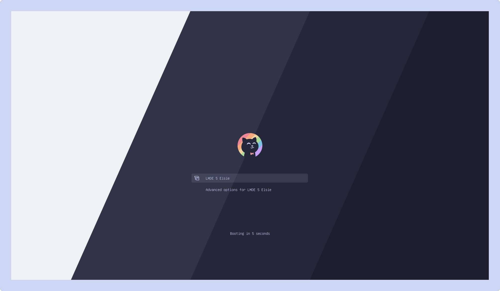
</p>

<p align="center">
  <b>A curated, premium collection of custom GRUB2 and Ventoy bootloader themes.</b><br/>
  Transform your boring boot screen into a visually stunning experience ranging from retro CRT terminals and gaming HUDs to modern glassmorphism and anime aesthetics.
</p>

<p align="center">
  
  
  
  
  
</p>

---

## 📑 Table of Contents

- [✨ Collection Highlights](#-collection-highlights)
- [🖼️ Theme Gallery & Showcase](#️-theme-gallery--showcase)
  - [🕹️ Gaming & Pop Culture](#️-gaming--pop-culture)
  - [📟 Retro, Terminal & Cyberpunk](#-retro-terminal--cyberpunk)
  - [🌸 Anime, Art & Aesthetic](#-anime-art--aesthetic)
  - [💎 Modern, Minimalist & OS Styles](#-modern-minimalist--os-styles)
- [📊 Quick Comparison Matrix](#-quick-comparison-matrix)
- [🚀 Universal Installation Guide](#-universal-installation-guide)
  - [1. Automatic / Scripted Installation](#1-automatic--scripted-installation)
  - [2. Universal Manual Installation (All Distros)](#2-universal-manual-installation-all-distros)
  - [3. Distribution-Specific GRUB Update Commands](#3-distribution-specific-grub-update-commands)
- [💾 Ventoy USB Bootloader Setup](#-ventoy-usb-bootloader-setup)
- [🛠️ Customization & Tips](#️-customization--tips)
- [❓ Troubleshooting & FAQ](#-troubleshooting--faq)
- [📁 Repository Structure](#-repository-structure)
- [📜 License & Credits](#-license--credits)

---

## ✨ Collection Highlights

- 🖥️ **Multi-Resolution Ready**: Crisp support for 1080p (FHD), 1440p (2K), and 2160p (4K) displays.
- 🐧 **Rich Distribution Icon Packs**: Hundreds of tailored icons for Arch, Debian, Fedora, Ubuntu, NixOS, Void, Gentoo, Kali, Windows, and more.
- ⚡ **Zero Performance Impact**: Lightweight styling using native GRUB2 font rendering (`pf2`) and optimized graphics.
- 🧰 **Ventoy Compatible**: Ready-to-deploy themes for portable multi-boot USB drives.
- 🪄 **Installer Scripts Included**: Automated setup scripts for quick 1-command deployment.

---

## 🖼️ Theme Gallery & Showcase

### 🕹️ Gaming & Pop Culture

#### 1. ULTRAKILL REVAMP
> High-octane retro-futuristic arcade FPS HUD interface featuring animated sprites, custom pixel font (`ultrafont2`), and multi-language support (17 languages).

<p align="center">
  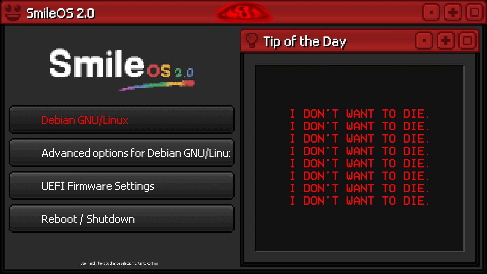
</p>

* **Directory**: [`ultrakill/`](./ultrakill) | [`ultrakill_grub/`](./ultrakill_grub)
* **Resolution**: 1080p (Full HD)
* **Installer**: `cd ultrakill && sudo ./install.sh`

---

#### 2. Space Isolation (Alien: Isolation™)
> Atmospheric survival horror bootloader theme inspired by the retro-futuristic Sevastopol Interface CRT terminals from Alien: Isolation.

<p align="center">
  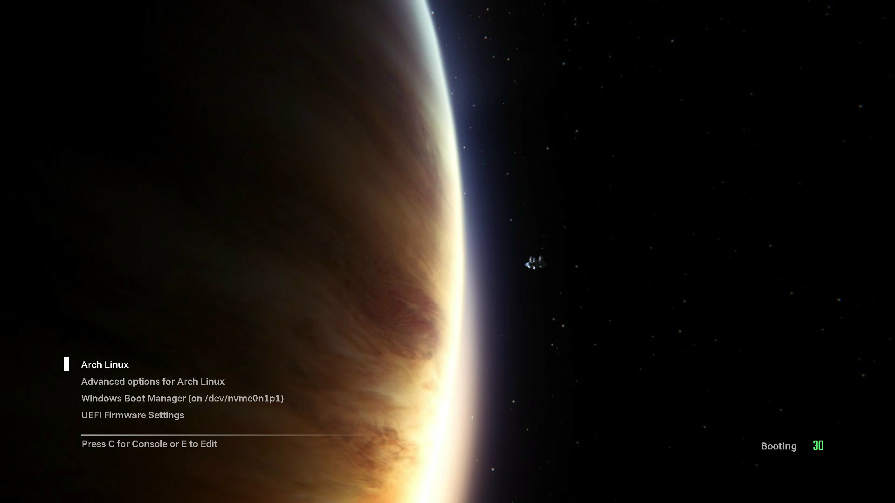
</p>

* **Directory**: [`space-isolation/`](./space-isolation)
* **Resolution**: 1920x1080 & 2560x1440 (2K)
* **Features**: Authentic CRT typography, green phosphor tones, center/padding auto-scaling.

---

#### 3. Grubphemous (Blasphemous™)
> Dark fantasy pixel art theme inspired by Blasphemous, featuring the Penitent One and 4 interchangeable background artworks.

<p align="center">
  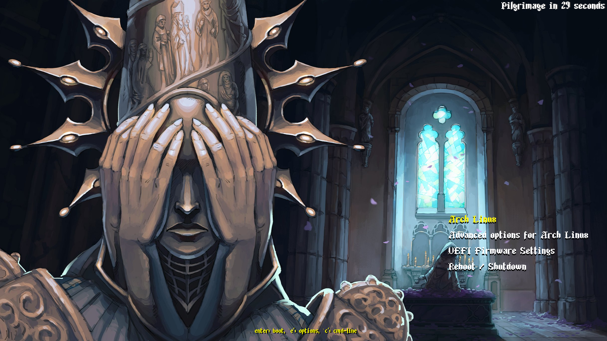
</p>

* **Directory**: [`grubphemous-theme/`](./grubphemous-theme)
* **Background Variants**: Penitent, Crisanta, Escribar, Amanecidas
* **Installer**: `cd grubphemous-theme && sudo ./install_theme.sh`

---

#### 4. Sekiro: Shadows Die Twice
> Moonlit feudal Japanese aesthetic with Wolf overlooking the landscape, custom Hack Bold font, and sleek right-aligned menu layout.

<p align="center">
  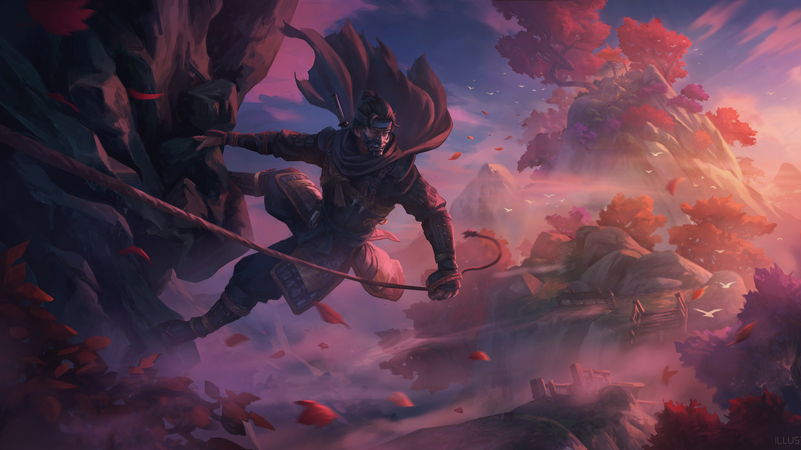
</p>

* **Directory**: [`SekiroShadow/`](./SekiroShadow)
* **Resolution**: 1080p
* **Features**: Minimalist sidebar layout, glowing crimson item highlights.

---

#### 5. GTA San Andreas (GTG Menu)
> Nostalgic Grand Theft Auto: San Andreas main menu replica theme with signature typography, custom cursor pointers, and Ventoy edition.

<p align="center">
  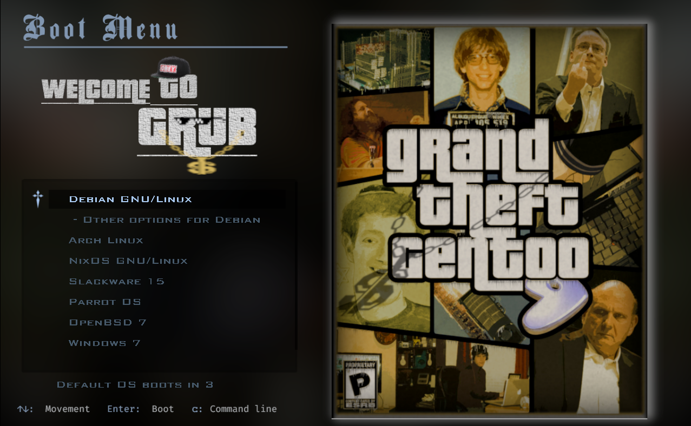
</p>

* **Directory**: [`grub_gtg-main/`](./grub_gtg-main)
* **Variants**: Standard GRUB2 & Ventoy USB edition
* **Installer**: `cd grub_gtg-main && sudo ./install.sh`

---

#### 6. BBGrub (Breaking Bad)
> Iconic Heisenberg / Walter White themed GRUB bootloader featuring high-contrast artwork and a comprehensive 70+ OS icon suite.

<p align="center">
  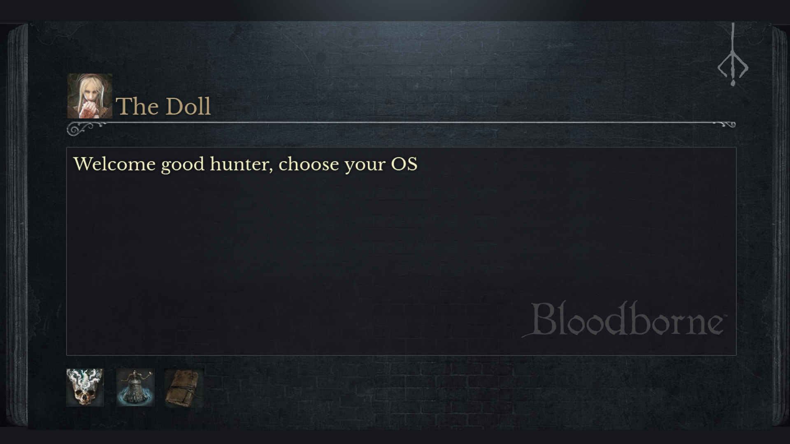
</p>

* **Directory**: [`BBGrub/`](./BBGrub)
* **Resolution**: 1080p
* **Features**: Fixedsys retro bitmap font, full OS icon set.

---

#### 7. Nightmare Before Christmas (Ventoy & GRUB)
> Tim Burton inspired silhouette theme with spooky typography and full resolution scalability.

<p align="center">
  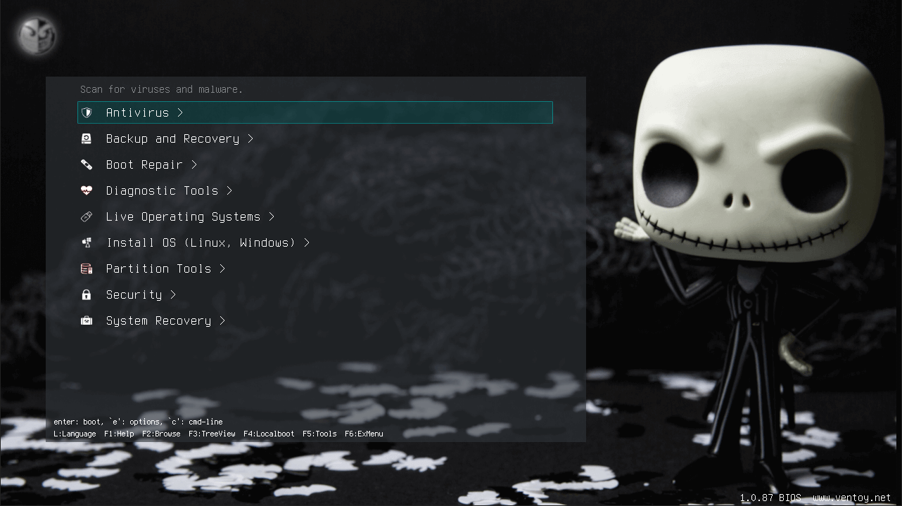
</p>

* **Directory**: [`Ventoy-Nightmare-Grub-Theme-main/`](./Ventoy-Nightmare-Grub-Theme-main)
* **Resolutions**: 800x600, 1024x768, 1280x720, 1280x1024, 1440x900, 1536x864, 1920x1080
* **Compatibility**: Standard GRUB2 and native Ventoy USB bootloaders.

---

### 📟 Retro, Terminal & Cyberpunk

#### 8. CRT Amber Phosphor
> Authentic 1980s monochrome Amber Phosphor CRT monitor theme with simulated scanlines, terminal glow, and vintage distro badges.

<p align="center">
  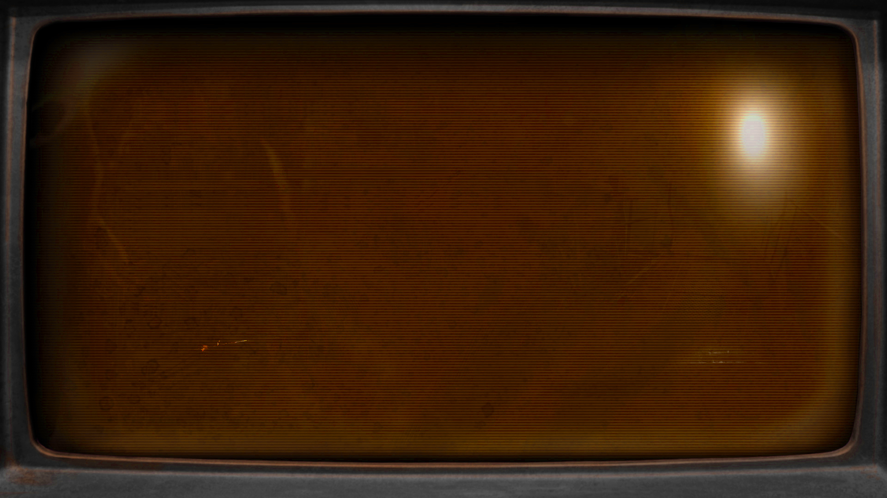
</p>

* **Directory**: [`CRT-Amber-GRUB-Theme/`](./CRT-Amber-GRUB-Theme)
* **Resolution**: 1080p
* **One-Click Installer**: `sudo ./install_crt_amber.sh`

---

#### 9. Why1 (Whynoodlesss Terminal)
> Clean, dark pixel terminal boot menu featuring bitmap typography and crisp minimalist distro badges.

<p align="center">
  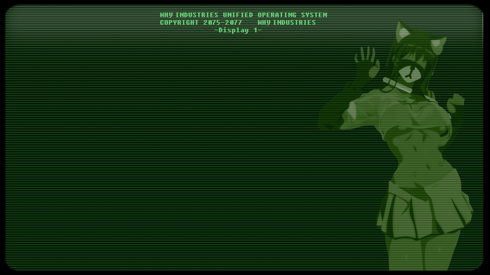
</p>

* **Directory**: [`Why1/`](./Why1)
* **Resolution**: 1080p
* **Installer**: `cd Why1 && sudo ./install.sh`

---

#### 10. CrossGrub
> Minimalist retro crosshair bootloader interface with clean centered selection and border framing.

<p align="center">
  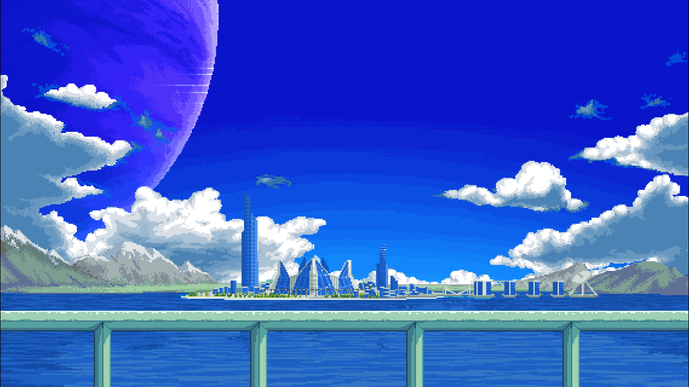
</p>

* **Directory**: [`crossgrub/`](./crossgrub)
* **Resolution**: 1440p (2K) / 1080p scalable

---

#### 11. GreyFocus
> Distraction-free, ultra-minimal monochromatic dark theme with smooth grey highlights and clean lines.

<p align="center">
  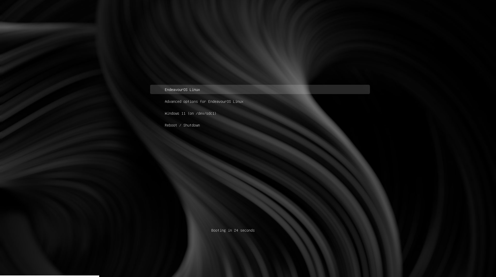
</p>

* **Directory**: [`GreyFocus-grub2theme-main/`](./GreyFocus-grub2theme-main)
* **Resolution**: 1080p
* **Installer**: `cd GreyFocus-grub2theme-main && sudo ./install.sh`

---

### 🌸 Anime, Art & Aesthetic

#### 12. Aesthetic (Lo-Fi Scenery)
> Calming pastel lo-fi landscape theme with soft tones, sleek borders, and smooth UI contrast.

<p align="center">
  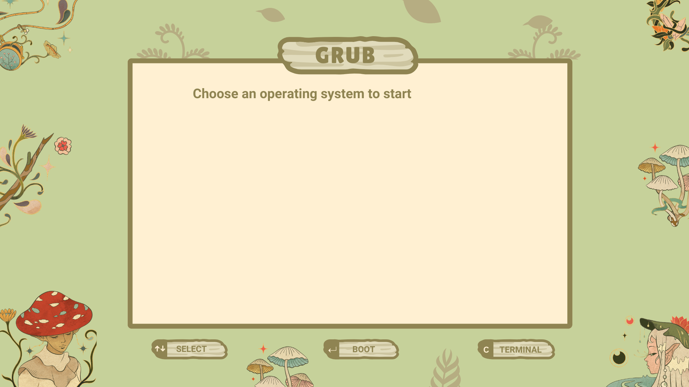
</p>

* **Directory**: [`Aesthetic/`](./Aesthetic)
* **Resolution**: 1080p

---

#### 13. Anime Scenery
> Vibrant anime visual artwork with dark translucent boot selection frame and crisp Hack bold font.

<p align="center">
  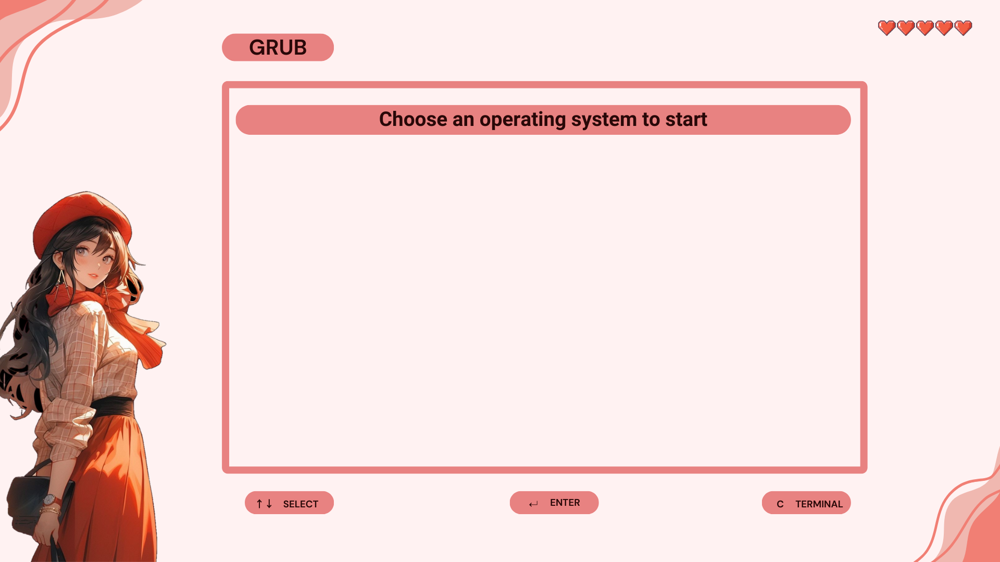
</p>

* **Directory**: [`Anime/`](./Anime)
* **Resolution**: 1080p

---

#### 14. Cartoon Girl
> Modern whimsical digital illustration theme with rounded selection boxes and clean font layout.

<p align="center">
  
</p>

* **Directory**: [`CartoonGirl/`](./CartoonGirl)
* **Resolution**: 1080p

---

### 💎 Modern, Minimalist & OS Styles

#### 15. Catppuccin Collection (4 Flavors)
> Soothing pastel palette theme suite for GRUB & Ventoy available in all 4 official Catppuccin flavors: 🌻 **Latte**, 🪴 **Frappé**, 🌺 **Macchiato**, and 🌿 **Mocha**.

<p align="center">
  
</p>

<details>
<summary><b>🔍 Click to view individual flavor previews</b></summary>

| 🌿 Mocha (Dark) | 🌺 Macchiato |
| :---: | :---: |
|  |  |
| **🪴 Frappé** | **🌻 Latte (Light)** |
| 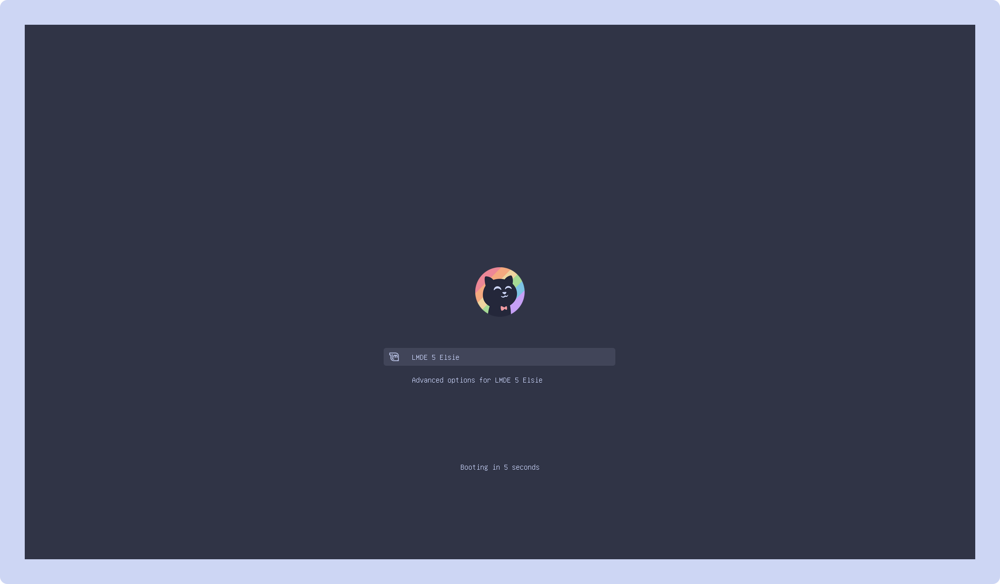 | 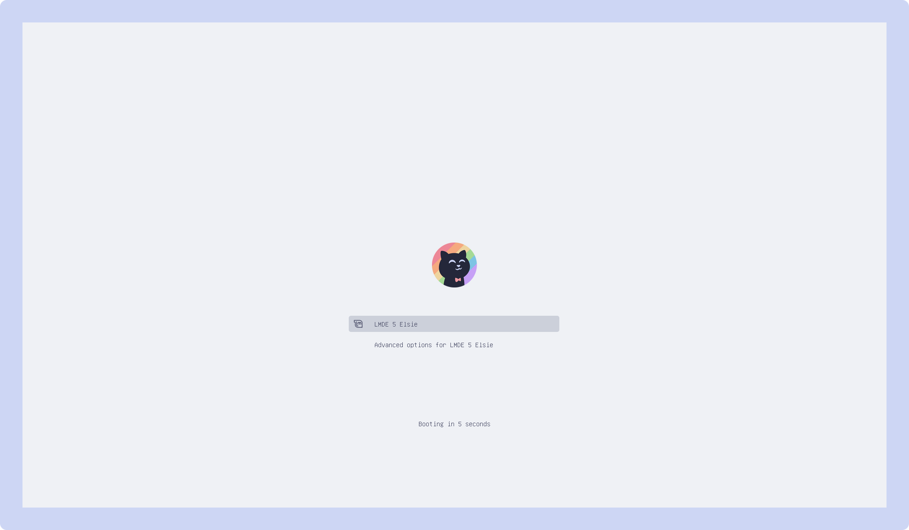 |

</details>

* **Directory**: [`catpuccin/`](./catpuccin)
* **Flavors**: Mocha, Macchiato, Frappe, Latte
* **Ventoy Support**: Included in `catpuccin/ventoy/`

---

#### 16. Elegant GRUB2 Themes Suite
> Modern, high-end theme suite featuring multiple wallpaper presets (Forest, Mojave, Mountain, Wave, Blur, Dark/Light) and automated installer with font generation.

<p align="center">
  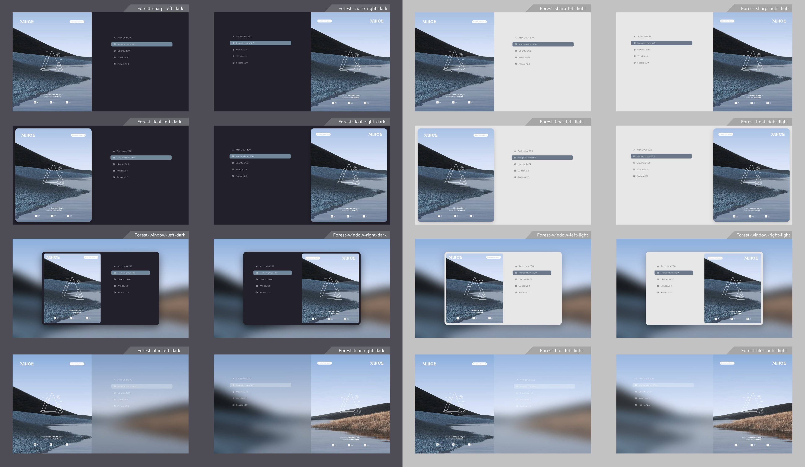
</p>

<details>
<summary><b>🔍 View additional Elegant theme styles</b></summary>

| Wave Style | Mojave Style | Forest Style |
| :---: | :---: | :---: |
| 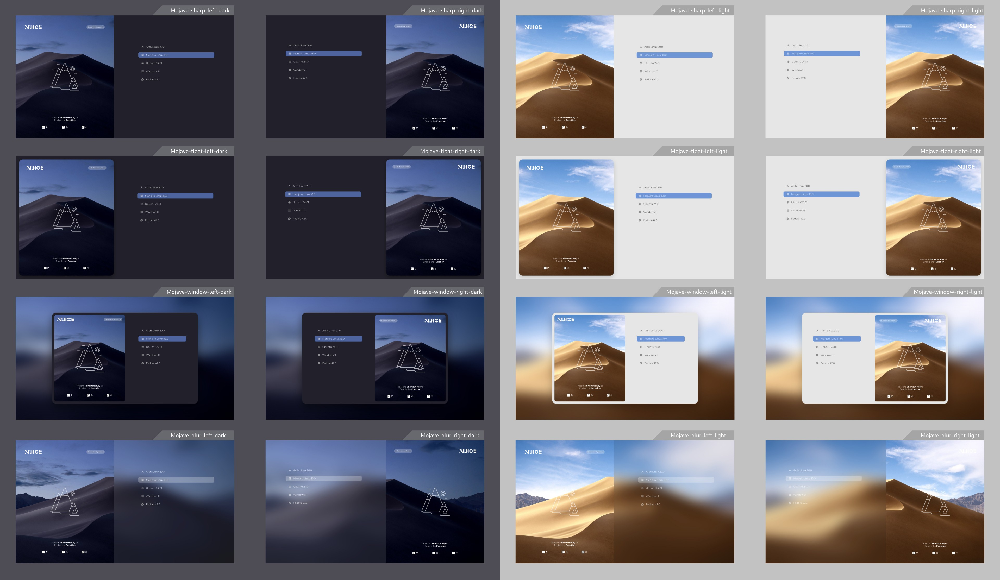 | 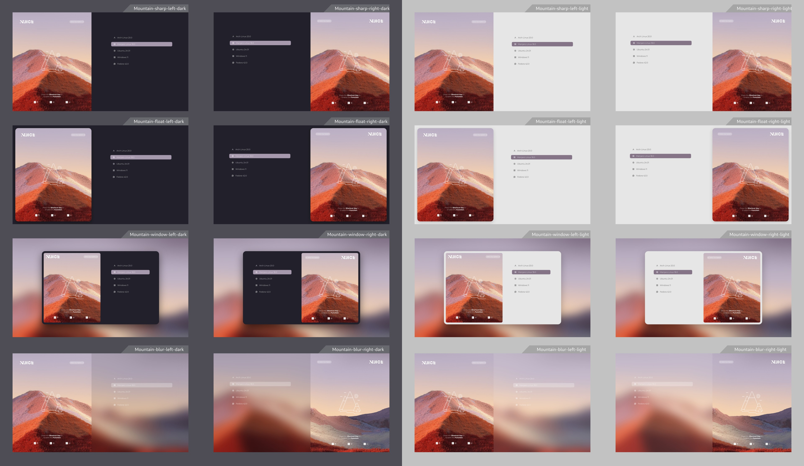 | 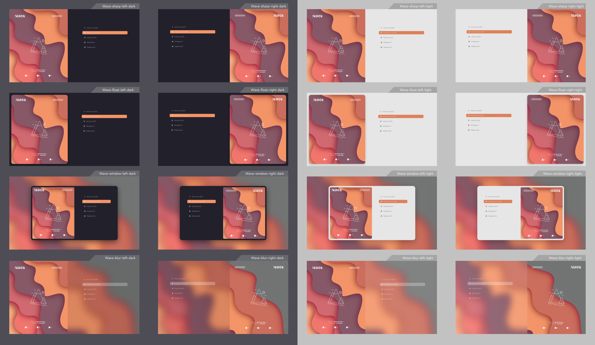 |

</details>

* **Directory**: [`Elegant-grub2-themes/`](./Elegant-grub2-themes)
* **Resolution**: 1080p, 2K, 4K UHD
* **Installer**: `cd Elegant-grub2-themes && sudo ./install.sh`

---

#### 17. Matrices Circle Window (1080p / 2K / 4K)
> Futuristic circular frosted icon matrix with glowing selection borders and dedicated resolution scaling.

<p align="center">
  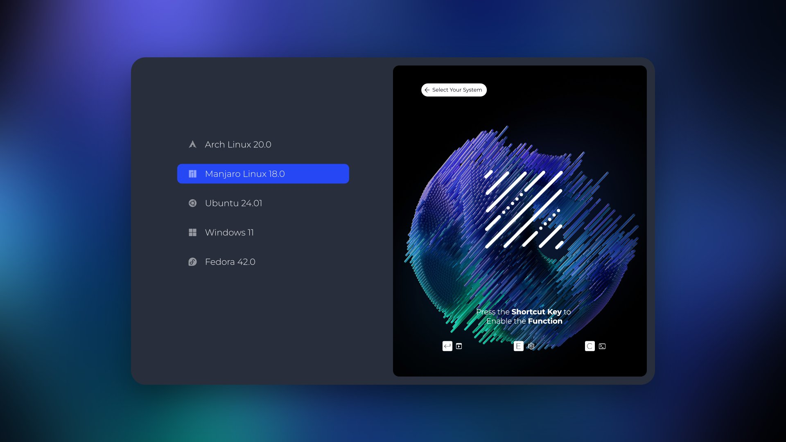
</p>

* **Directory**: [`Matrices-circle-window-grub-themes/`](./Matrices-circle-window-grub-themes)
* **Resolutions**: 1080p, 2K (1440p), 4K (2160p)
* **Installers**: `1080p/install.sh`, `2k/install.sh`, `4k/install.sh`

---

#### 18. Particle Sidebar (1080p / 2K / 4K)
> Modern particle mesh background with a sleek left-aligned vertical sidebar and rich OS distro badges.

<p align="center">
  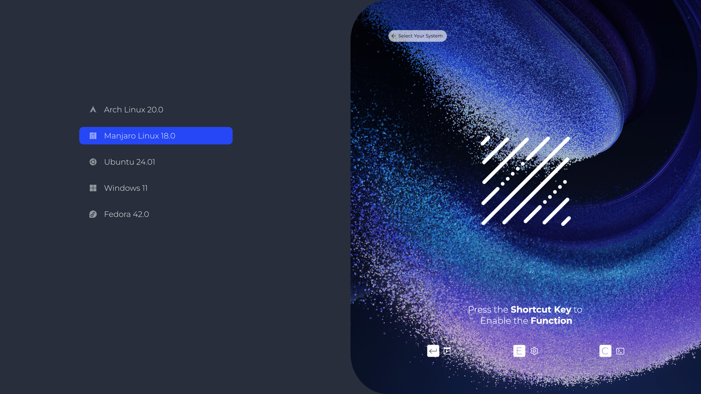
</p>

* **Directory**: [`Particle-sidebar-grub-themes/`](./Particle-sidebar-grub-themes)
* **Resolutions**: 1080p, 2K (1440p), 4K (2160p)
* **Installers**: `1080p/install.sh`, `2k/install.sh`, `4k/install.sh`

---

#### 19. Windows 11 Fluent Design
> Clean Windows 11 Fluent OS style bootloader interface with modern wallpapers and refined left-aligned boot items.

<p align="center">
  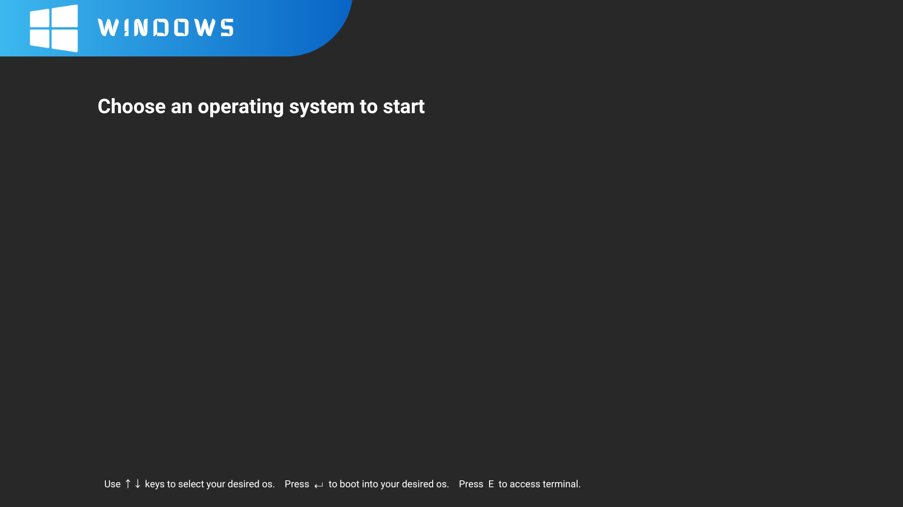
</p>

* **Directory**: [`Windows-Main/`](./Windows-Main)
* **Resolution**: 1080p

---

## 📊 Quick Comparison Matrix

| Theme Name | Style / Aesthetic | Resolutions Supported | Script Installer | Ventoy Ready |
| :--- | :--- | :---: | :---: | :---: |
| **ULTRAKILL Revamp** | 🕹️ Arcade FPS / Retro HUD | 1080p | ✅ (`install.sh`) | ❌ |
| **Space Isolation** | 🛸 Alien: Isolation CRT HUD | 1080p, 1440p (2K) | 🟡 Manual | ❌ |
| **Grubphemous** | 🗡️ Blasphemous Pixel Art | 1080p | ✅ (`install_theme.sh`) | ❌ |
| **Sekiro Shadow** | 🥷 Feudal Japanese Shinobi | 1080p | 🟡 Manual | ❌ |
| **GTA San Andreas** | 🚗 GTA:SA Main Menu | 1080p | ✅ (`install.sh`) | ✅ (`ventoy.sh`) |
| **BBGrub** | 🧪 Breaking Bad / Heisenberg | 1080p | 🟡 Manual | ❌ |
| **Nightmare Theme** | 🎃 Spooky Silhouette | 800x600 to 1080p | 🟡 Manual | ✅ Native |
| **CRT Amber** | 📟 80s Amber Phosphor Terminal | 1080p | ✅ (`install_crt_amber.sh`)| ❌ |
| **Why1** | 👾 Retro Fixedsys Pixel Art | 1080p | ✅ (`install.sh`) | ❌ |
| **CrossGrub** | 🎯 Centered Retro Crosshair | 1440p / 1080p | 🟡 Manual | ❌ |
| **GreyFocus** | 🌑 Dark Minimal Distraction-free | 1080p | ✅ (`install.sh`) | ❌ |
| **Aesthetic** | 🌸 Pastel Lo-Fi Scenery | 1080p | 🟡 Manual | ❌ |
| **Anime** | ⛩️ Anime Artwork | 1080p | 🟡 Manual | ❌ |
| **Cartoon Girl** | 🎨 Illustrated Character Art | 1080p | 🟡 Manual | ❌ |
| **Catppuccin (4x)** | ☕ Mocha / Macchiato / Frappé / Latte | 1080p+ | 🟡 Manual | ✅ (`ventoy/`) |
| **Elegant Themes** | 🌲 Forest / Mojave / Mountain / Wave | 1080p, 2K, 4K | ✅ (`install.sh`) | ❌ |
| **Matrices Circle**| 🪟 Frosted Circular Matrix | 1080p, 2K, 4K | ✅ (`install.sh`) | ❌ |
| **Particle Sidebar**| ✨ Particle Mesh & Sidebar | 1080p, 2K, 4K | ✅ (`install.sh`) | ❌ |
| **Windows Fluent** | 🪟 Windows 11 Fluent OS | 1080p | 🟡 Manual | ❌ |

---

## 🚀 Universal Installation Guide

> [!IMPORTANT]
> Always make a backup of your `/etc/default/grub` before modifying your bootloader configuration.

### 1. Automatic / Scripted Installation

Several themes come with built-in automated installation scripts:

```bash
# Example: Installing CRT Amber Theme
sudo ./install_crt_amber.sh

# Example: Installing ULTRAKILL Revamp
cd ultrakill
sudo ./install.sh

# Example: Installing Elegant GRUB2 Themes
cd Elegant-grub2-themes
sudo ./install.sh

# Example: Installing Matrices Circle Window (1080p / 2K / 4K)
cd Matrices-circle-window-grub-themes/1080p
sudo ./install.sh

# Example: Installing Particle Sidebar (1080p / 2K / 4K)
cd Particle-sidebar-grub-themes/1080p
sudo ./install.sh
```

---

### 2. Universal Manual Installation (All Distros)

For any theme in this repository, you can manually install it in 4 simple steps:

#### Step 1: Copy Theme Directory to GRUB Themes Folder
```bash
# Create the GRUB themes directory if it does not exist
sudo mkdir -p /boot/grub/themes

# Copy your chosen theme folder (e.g. Catppuccin Mocha)
sudo cp -r catpuccin/src/catppuccin-mocha-grub-theme /boot/grub/themes/catppuccin-mocha
```

#### Step 2: Configure `/etc/default/grub`
Open your GRUB default configuration file with `sudo`:
```bash
sudo nano /etc/default/grub
```

Set the theme path and graphics mode:
```ini
# Enable graphical terminal
GRUB_TERMINAL_OUTPUT="gfxterm"

# Set your display resolution (e.g. 1920x1080, 2560x1440, 3840x2160, or auto)
GRUB_GFXMODE="1920x1080,auto"

# Point to the theme.txt file
GRUB_THEME="/boot/grub/themes/catppuccin-mocha/theme.txt"
```

Save and exit (`Ctrl+O`, `Enter`, `Ctrl+X` in nano).

#### Step 3: Re-generate the GRUB Configuration
Run the command corresponding to your Linux distribution:

---

### 3. Distribution-Specific GRUB Update Commands

* **Arch Linux / Manjaro / EndeavourOS / Garuda**:
  ```bash
  sudo grub-mkconfig -o /boot/grub/grub.cfg
  ```

* **Ubuntu / Debian / Linux Mint / Pop!_OS**:
  ```bash
  sudo update-grub
  ```

* **Fedora / RHEL (UEFI & BIOS)**:
  ```bash
  # Fedora UEFI systems:
  sudo grub2-mkconfig -o /boot/grub2/grub.cfg
  # (Or if on older Fedora UEFI):
  sudo grub2-mkconfig -o /boot/efi/EFI/fedora/grub.cfg
  ```

* **openSUSE / SUSE**:
  ```bash
  sudo grub2-mkconfig -o /boot/grub2/grub.cfg
  ```

* **Gentoo / Void Linux**:
  ```bash
  sudo grub-mkconfig -o /boot/grub/grub.cfg
  ```

#### Step 4: Reboot
```bash
sudo reboot
```

---

## 💾 Ventoy USB Bootloader Setup

Several themes in this collection natively support **[Ventoy](https://www.ventoy.net/)** multi-boot USB flash drives:

### Method:
1. Plug in your Ventoy USB drive.
2. In the root partition of your Ventoy USB drive, create a `ventoy` folder if it doesn't already exist:
   ```
   /ventoy/
   └── theme/
   ```
3. Copy the desired Ventoy theme folder (e.g., `Ventoy-Nightmare-Grub-Theme-main` or `catpuccin/ventoy/src/mocha/catppuccin-mocha`) into `/ventoy/theme/`.
4. Create or edit `/ventoy/ventoy.json` on the USB drive with the following content:

```json
{
    "theme": {
        "file": "/ventoy/theme/catppuccin-mocha/theme.txt",
        "gfxmode": "1920x1080",
        "display_mode": "GUI",
        "serial_param": "--unit=0 --speed=9600",
        "ventoy_left": "5%",
        "ventoy_top": "95%",
        "ventoy_color": "#cdd6f4"
    }
}
```

---

## 🛠️ Customization & Tips

### Previewing GRUB Themes Without Rebooting
You can preview your installed GRUB themes inside your current desktop session using `grub-emu`:

```bash
# On Arch / Manjaro
sudo pacman -S grub-emu
sudo grub-emu

# On Ubuntu / Debian
sudo apt install grub-emu
sudo grub-emu
```

### Changing Background Images
Every theme folder contains a `background.png` or `background.jpg` referenced in its `theme.txt`. You can replace the image with your own custom wallpaper (matching the same filename and resolution).

### Modifying Fonts & Colors
Open the theme's `theme.txt` file:
* Change `item_color` and `selected_item_color` to hex values (e.g., `#ffffff`, `#f38ba8`).
* Adjust `boot_menu` coordinates (`left`, `top`, `width`, `height`) to reposition the menu anywhere on the screen.

---

## ❓ Troubleshooting & FAQ

<details>
<summary><b>1. GRUB theme does not appear / Default black-and-white menu shows up</b></summary>

- Ensure `GRUB_TERMINAL_OUTPUT="gfxterm"` is active (uncommented) in `/etc/default/grub`.
- Verify the path in `GRUB_THEME` points directly to the `theme.txt` file, not just the directory.
- Verify that your graphics drivers/VBE mode support the configured resolution. Set `GRUB_GFXMODE="auto"` if your monitor has issues with high resolutions.
- Don't forget to run `sudo grub-mkconfig -o /boot/grub/grub.cfg` (or `sudo update-grub`) after editing `/etc/default/grub`.
</details>

<details>
<summary><b>2. Screen resolution looks stretched or blurry</b></summary>

In `/etc/default/grub`, ensure `GRUB_GFXMODE` matches your native screen resolution:
```ini
GRUB_GFXMODE="1920x1080,auto"
GRUB_GFXPAYLOAD_LINUX="keep"
```
</details>

<details>
<summary><b>3. How do I revert to the default GRUB theme?</b></summary>

1. Open `/etc/default/grub`:
   ```bash
   sudo nano /etc/default/grub
   ```
2. Comment out or delete the `GRUB_THEME=` line:
   ```ini
   # GRUB_THEME="/boot/grub/themes/..."
   ```
3. Update GRUB:
   ```bash
   sudo grub-mkconfig -o /boot/grub/grub.cfg  # Arch/Fedora
   sudo update-grub                          # Ubuntu/Debian
   ```
</details>

---

## 📁 Repository Structure

```text
grub_themes/
├── Aesthetic/                           # Lo-Fi pastel scenery theme
├── Anime/                               # Stylized anime scenery theme
├── BBGrub/                              # Breaking Bad Walter White theme
├── CartoonGirl/                         # Illustrated cartoon girl art theme
├── CRT-Amber-GRUB-Theme/                # Retro 80s CRT Amber phosphor terminal
├── Elegant-grub2-themes/                # Multi-style elegant theme suite
├── GreyFocus-grub2theme-main/           # Distraction-free dark grey theme
├── Matrices-circle-window-grub-themes/  # Frosted circular icon matrix (1080p, 2K, 4K)
├── Particle-sidebar-grub-themes/        # Modern particle mesh sidebar (1080p, 2K, 4K)
├── SekiroShadow/                        # Sekiro: Shadows Die Twice theme
├── Ventoy-Nightmare-Grub-Theme-main/    # Nightmare Before Christmas (GRUB & Ventoy)
├── Why1/                                # Whynoodlesss retro pixel art theme
├── Windows-Main/                        # Windows 11 Fluent OS style theme
├── catpuccin/                           # Catppuccin suite (Mocha, Macchiato, Frappé, Latte)
├── crossgrub/                           # Centered retro crosshair theme
├── grub_gtg-main/                       # GTA: San Andreas pause menu theme
├── grubphemous-theme/                   # Blasphemous pixel art theme (4 backgrounds)
├── space-isolation/                     # Alien: Isolation HUD theme (1080p & 1440p)
├── ultrakill/                           # ULTRAKILL Revamp animated arcade FPS theme
├── ultrakill_grub/                      # ULTRAKILL alternative bundle
├── install_crt_amber.sh                 # Quick installer for CRT Amber Theme
└── README.md                            # Documentation & showcase hub
```

---

## 📜 License & Credits

- All theme assets, fonts, and graphics belong to their respective creators and community contributors.
- Themes based on third-party games and media (*ULTRAKILL*, *Alien: Isolation*, *Blasphemous*, *Sekiro*, *GTA:SA*, *Breaking Bad*, *The Nightmare Before Christmas*, *Catppuccin*) are fan-made tributes and subject to their original media copyright and fair-use guidelines.

---

<p align="center">
  <b>Enjoy your new boot screen! ⭐ Don't forget to star this repository if you like the themes!</b>
</p>
